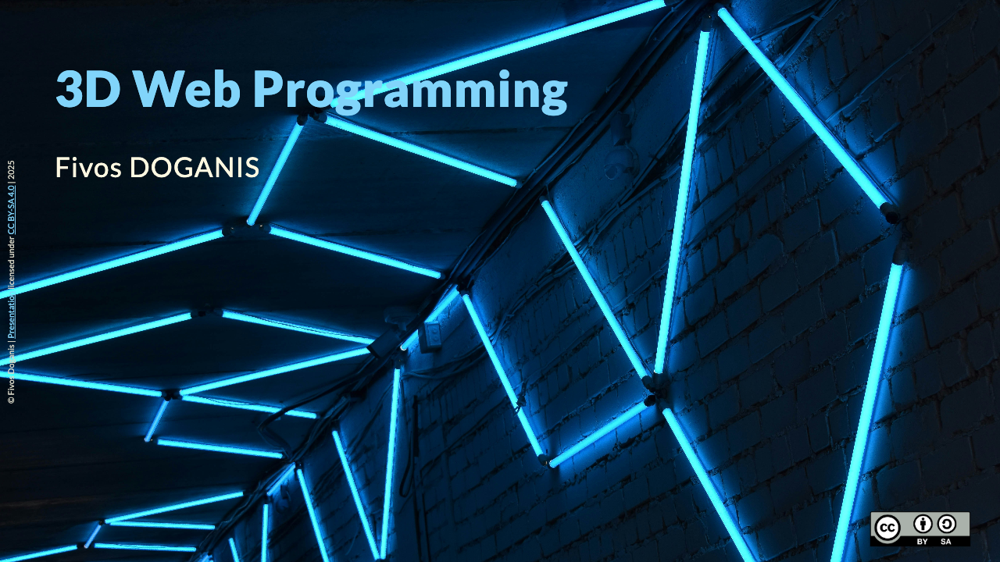
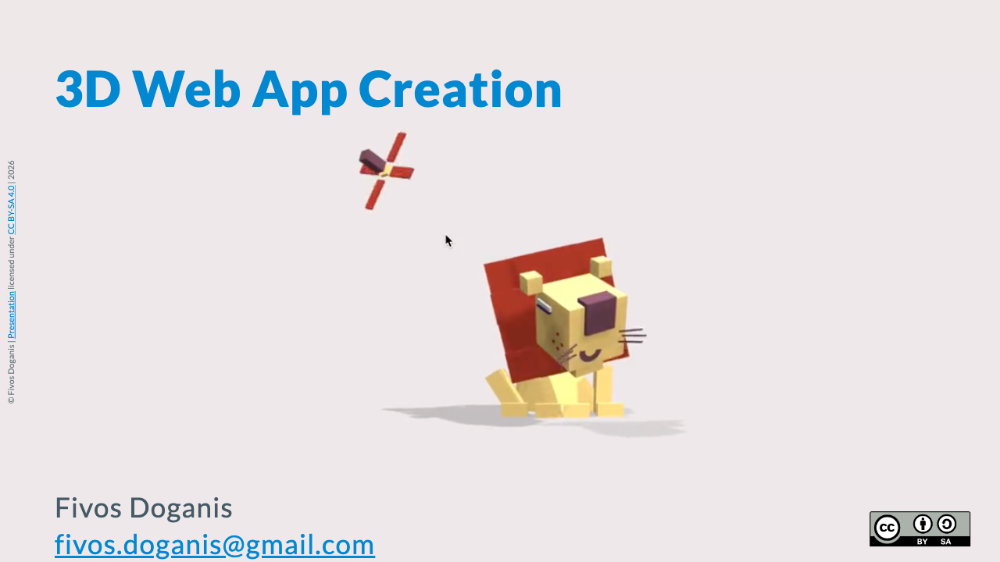
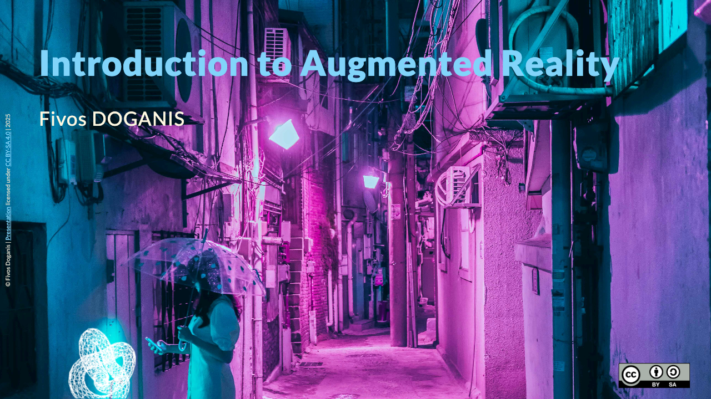
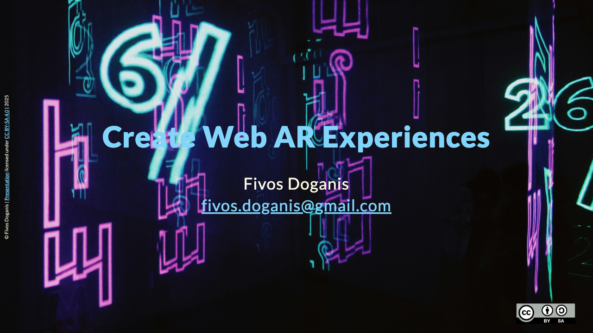

# 2025

 

 

## Web 3D Course

<table style="padding:10px">
  <tr>
    <td> 
         <a href="./web3d_presentation_20250201.html">
         <strong>Presentation</strong>
         </a>
         <a href="./web3d_presentation_20250201.pdf">[PDF]</a>
    </td>
  </tr>
  <tr>
    <td> 
         
    </td>
  </tr>
  <tr>
    <td> 
          <a href="./web3d_projects_20250201.html">
          <strong>Projects</strong>
         </a>
          <a href="./web3d_projects_20250201.pdf">[PDF]</a>
    </td>
  </tr>
  <tr>
    <td> 
          
    </td>
  </tr>
  <tr>
    <td> 
          <a href="./threejs_tips.md">
          <strong>THREE.js Tips</strong>
         </a>
    </td>
  </tr>
  <tr>
    <td> 
          
    </td>
  </tr>
  <tr>
      <td> 
          <a href="./cannon.md">
          <strong>Physics with Cannon</strong>
         </a>
      </td>
  </tr>
  <tr>
    <td> 
          
    </td>
  </tr>      
</table>

---

# Web AR Course

<table style="padding:10px">
  <tr>
    <td> 
         <a href="./ar_presentation_20250224.html">
         <strong>Presentation</strong>
         </a>
         <a href="./ar_presentation_20250224.pdf">[PDF]</a>
    </td>
  </tr>
  <tr>
    <td> 
         
    </td>
  </tr>
  <tr>
    <td> 
          <a href="./ar_projects_202502241.html">
          <strong>Projects</strong>
          <a href="./ar_projects_202502241.pdf">[PDF]</a>
    </td>
  </tr>
  <tr>
    <td> 
          
    </td>
  </tr>
  <tr>
    <td> 
          <a href="./webxr_tips.md">
          <strong>WebXR Tips</strong>
         </a>
    </td>
  </tr>
  <tr>
    <td> 
          
    </td>
  </tr>
  <tr>
    <td> 
          <a href="./bodytracking.md">
          <strong>Body Tracking</strong>
         </a>
    </td>
  </tr>      
  <tr>
    <td> 
          
    </td>
  </tr>      
</table>

# Project Development

<table style="padding:10px">
<tr>
  <td> 
         <a href="./project_20240512.html">
         <strong>Project Development Guide</strong>
         </a>
          </td>
</tr>
  <tr>
    <td> 
         
    </td>
    </tr>
</table>

---

# 2024

 

 

# EPITA Augmented Reality Course - 2024-10-09

## Web 3D

-  [Presentation](./web3d_presentation_EPITA_20241006.html) [[PDF](./web3d_presentation_EPITA_20241006.pdf)]
-  [Projects](./web3d_projects_EPITA_20241007.html) [[PDF](./web3d_projects_EPITA_20241007.pdf)]

- Extras
  - [THREE.js Tips](./threejs_tips.md)
  - [Physics with Cannon](./cannon.md)

## Web AR

- [Presentation](./ar_presentation_EPITA_20241102.html) [[PDF](./ar_presentation_EPITA_20241102.pdf)]
- [Projects](./ar_projects_EPITA_20241102.html) [[PDF](./ar_projects_EPITA_20241102.pdf)]

- Extras
  - [WebXR Tips](./webxr_tips.md)
  - [Body tracking](./bodytracking.md)

---

 

 

# ENSIMAG Technology Conference - 2024-10-04

## [AR Introduction](./ar_tech_conf_20241005.html)

## [WebXR Projects](./webxr_intro_20241005.html)

---

# 2021

# Atelier Web 3D AR VR

## [Atelier de programmation (stage découverte)](./Atelier_programmation_Web3D_AR_VR.html)

---

## Source: https://github.com/fdoganis/slides
